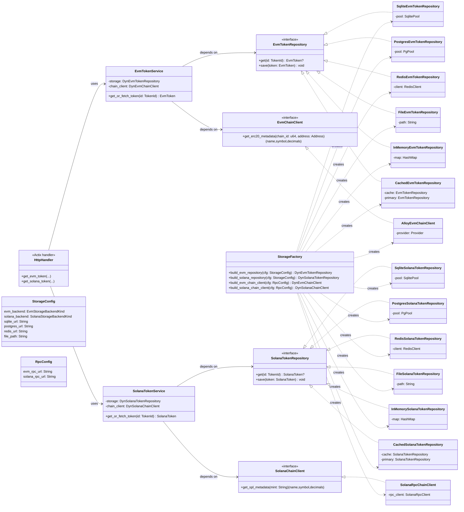

## TokenAPI Architecture

This document describes the high-level architecture of the TokenAPI service, focusing on how EVM and Solana token metadata is fetched, stored, and exposed via HTTP.

The main goals are:

-   **Separation of concerns** between HTTP, application logic, chain access, and persistence.
-   **Backend-agnostic domain logic**, with pluggable repositories for SQLite, Postgres, Redis, file, and in-memory storage.
-   **Easy multi-chain extensibility**, starting with EVM and Solana.

---

## Project structure

Recommended structure (matching the current/future design):

```text
src/
  main.rs                  # HTTP entrypoint (Actix Web), wiring config + services

  token.rs                 # Core token domain types: Token<T>, TokenId, EvmTokenDetails, SolanaTokenDetails
  evm_token.rs             # EVM-specific domain logic: EvmToken, EvmTokenService (future)
  erc20.rs                 # Alloy-generated ERC20 binding
  schema.rs                # Diesel schema (SQLite/Postgres)

  repositories/            # Persistence layer (per-domain repositories + impls)
    mod.rs                 # Traits like EvmTokenRepository, SolanaTokenRepository, factory helpers
    sqlite/                # SQLite-backed repository implementations
      mod.rs               # sqlite-specific module exports
      db.rs                # connection / pool helpers (establish_connection, etc.)
      evm.rs               # SqliteEvmTokenRepository implementation
    # postgres/
    #   mod.rs
    #   db.rs
    #   evm.rs
    # redis/
    #   mod.rs
    #   evm.rs
    # file/
    #   mod.rs
    #   evm.rs
    # memory/
    #   mod.rs
    #   evm.rs
```

As the system grows, Solana-specific repositories and services can be added in parallel to the EVM ones without changing existing handlers or repository users.

---

## Layers and responsibilities

-   **HTTP layer (`main.rs`)**

    -   Defines Actix handlers like `get_evm_token` and `get_solana_token`.
    -   Parses path/body, validates input, and maps domain results/errors to `HttpResponse`.
    -   Does **not** contain chain or persistence details.

-   **Services (`evm_token.rs`, future `solana_*`)**

    -   Implement application logic such as:
        -   “Given a token ID, load from repository; if missing, fetch from chain; then store & return.”
    -   Depend on repository traits and chain-client traits, not on concrete database or RPC types.
    -   Work purely in terms of domain types (`Token<T>`, `EvmTokenDetails`, etc.).

-   **Repositories (`src/repositories`)**

    -   Define domain-level interfaces like `EvmTokenRepository` and `SolanaTokenRepository`.
    -   Provide concrete implementations for different backends:
        -   SQLite (via Diesel)
        -   Postgres
        -   Redis (for caching or primary KV)
        -   File-based (JSON/CSV)
        -   In-memory (for tests / local dev)
    -   Encapsulate all persistence-specific concerns (SQL schemas, Redis keys, file formats, etc.).

-   **Chain clients (`erc20.rs` + future Solana client module)**
    -   Wrap EVM and Solana RPC logic behind small traits (e.g. `EvmChainClient`, `SolanaChainClient`).
    -   Hide provider/builder details from the services.

---

## EVM & Solana services with repositories (Mermaid)


